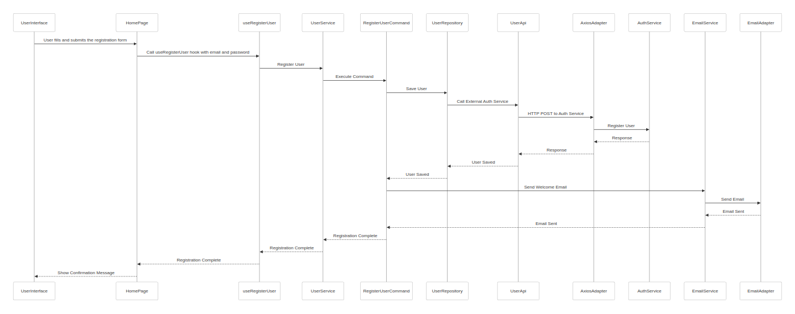

# FlexAuthAPI Demo Website

**The official website showcasing FlexAuthAPI integration.**

If you're looking for inspiration on how to integrate FlexAuthAPI, this is the resource you need.
The website demonstrates how to seamlessly integrate FlexAuthAPI into a website, simulating real-world conditions.

## Technical environment

- NextJs 14
- TypeScript 5
- React 18
- Shadcn
- TailwindCSS

## Engineering

The project incorporates three well-known design patterns commonly used in high-scale applications to enhance scalability, maintainability, and support for large team collaboration: **Hexagonal** Architecture, Domain-Driven Design (**DDD**), and Command Query Responsibility Segregation (**CQRS**). While adopting such designs may seem excessive for the scope of this demo, this choice serves to demonstrate the seamless integration and immediate compatibility of FlexAuthAPI with projects employing these complex architectural patterns.

### User Registration Workflow Diagram

To help developers understand how this demo application has been built and navigate its structure, the diagram below illustrates the user registration process. It provides a clear view of the actual flow of data and the interaction between components, highlighting the integration of key architectural principles in this project.

